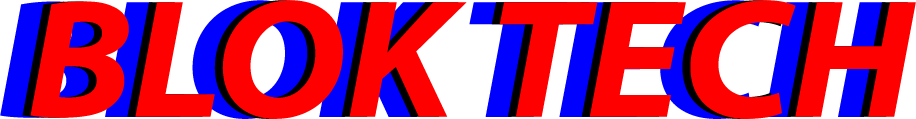

<section align="center" id="start"></section>
 

<section align="center">
  
  
  
  
</section>

<h2>📽 Project Informatie</h2>
  
Voor de opdracht maken we een Matching Applicatie waarin mensen met elkaar kunnen matchen op basis van behoeftes. Mijn project zal gaan over het liken en disliken van bepaalde producten/personen.

  
<b>De volgende features zullen in het project voorkomen:</b>

  <ul>
    <li>De gebruiker kan liken</li>
    <li>De gebruiker kan disliken</li>
    <li>De gebruiker kan matchen</li>
  </ul>
  
<h3>🔗 Bronnen:</h3>
  <ul>
    <li><a href="https://nodejs.org/en/" target="_blank">Node.js</a></li>
    <li><a href="https://expressjs.com/" target="_blank">Express</a></li>
    <li><a href="https://www.npmjs.com/package/express-handlebars" target="_blank">Express-Handlebars</a></li>
    <li>HTML5/CSS3/JavaScript</li>
  </ul>

<h2>⚙ Installatie</h2>

  
<h2>📝 Licentie</h2>
  
Er wordt gebruik gemaakt van de <a href="https://github.com/DaanDH12/TechRepo/blob/main/LICENSE">MIT</a> licentie binnen dit project.

  

(<a href="#start">terug naar start</a>)

